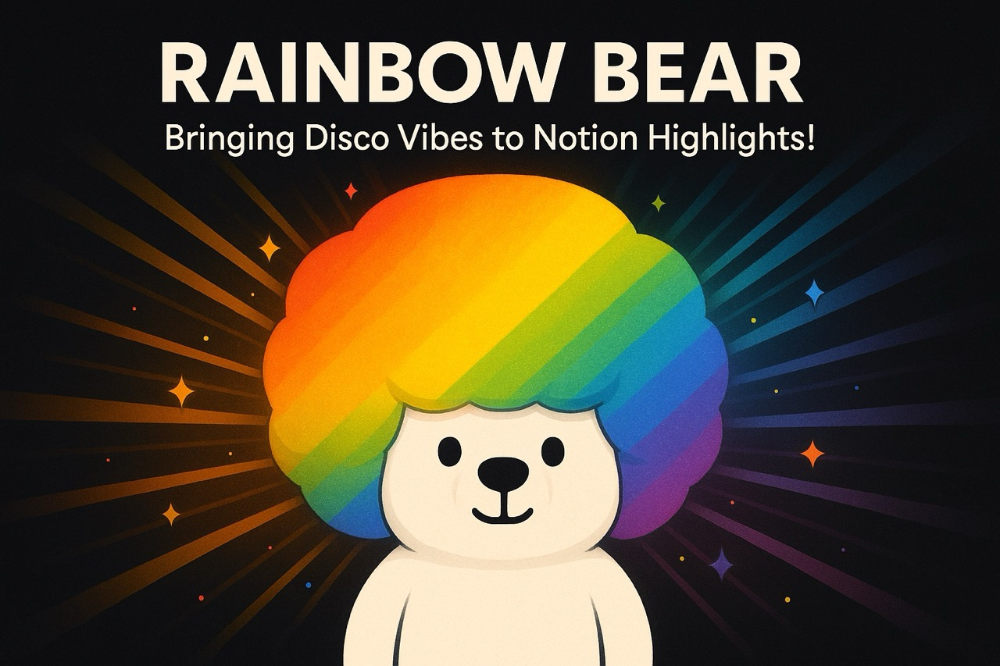
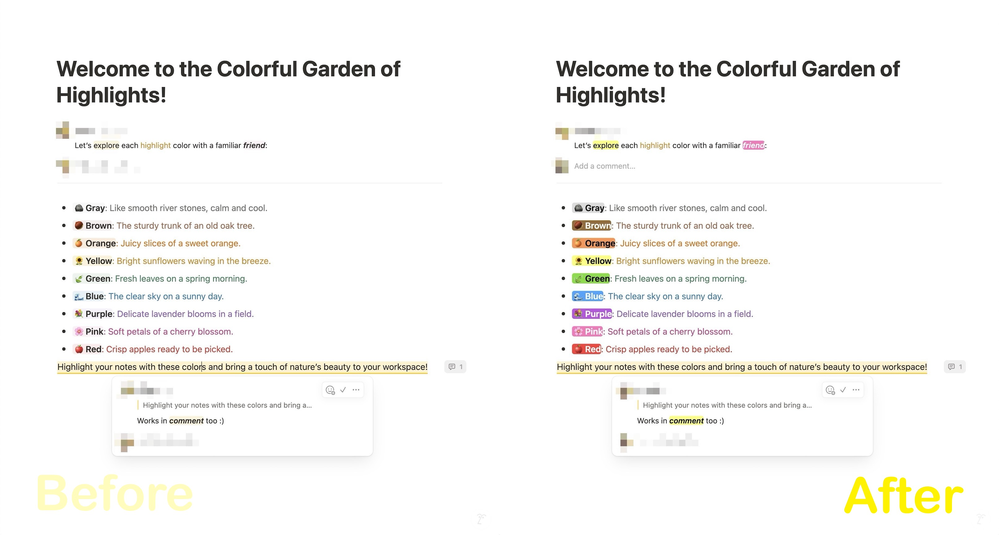

# Better Notion Highlights

Make your notes pop. See better. Think clearer.

## Overview

Better Notion Highlights is a browser extension that enhances your Notion experience by providing improved highlighting capabilities to make your notes more visually appealing and easier to read.

## Features

- Enhanced highlighting options
- Better visual distinction for important content
- Improved readability of your Notion pages

## Before & After

See the difference Better Notion Highlights makes to your Notion pages:

## Installation

This extension can be installed from the Chrome Web Store (coming soon ...) or loaded as an unpacked extension for development.

## Usage

Simply install the extension and start using it in your Notion workspace. The enhanced highlighting features will be automatically available.
