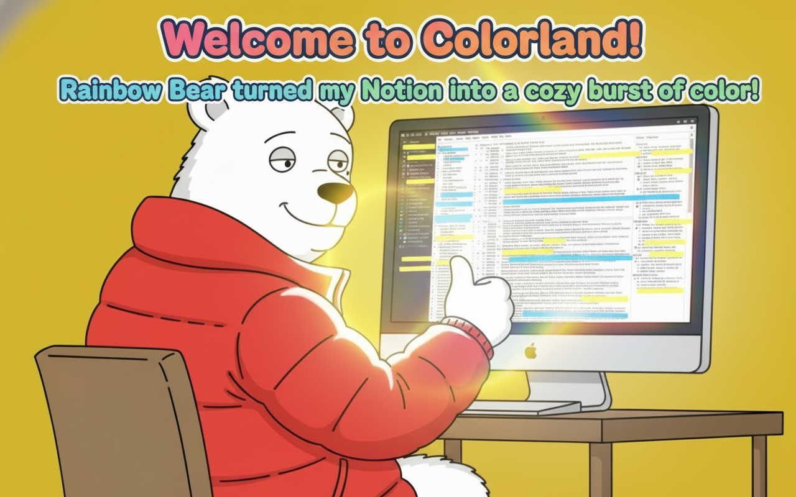

# 🐻‍❄️🌈 Rainbow Bear — Vivid, accessible Notion highlights

Make your Notion highlights pop! Rainbow Bear’s one and only purpose is to make highlights in Notion more vivid, more readable, and more friendly for users with color vision differences. Sprinkle a little rainbow on your workspace without changing how you use Notion. ✨




<a href="https://buymeacoffee.com/riiiiiiiiiina" target="_blank"></a>

## Why Rainbow Bear?

- **One single purpose**: Improve Notion’s highlight colors so important ideas stand out.
- **Vivid and readable**: Brighter, clearer highlight backgrounds with appropriate text contrast.
- **Customize your palette**: Pick your own background and text color per Notion highlight color.
- **Dark/light aware**: Works nicely with both Notion themes.
- **Private and lightweight**: Uses only `storage` permission. No analytics, no tracking, no network calls.

## How it works (peek under the hood)

- The extension injects CSS variables and styles to replace Notion’s default highlight swatches.
- Your color choices and toggles are saved via `chrome.storage.sync`.
- Changes apply instantly across all Notion tabs and survive refreshes.

Key files if you’re curious:

- `styles.css` — base highlight rules and optional animation keyframes.
- `content_script.js` — applies styles and reacts to saved setting changes.
- `options.html` + `options.js` — a friendly panel to pick colors and toggles.

## Install

### From the Chrome Web Store

- Install the extension from the [Chrome Web Store](https://chromewebstore.google.com/detail/rainbow-bear/ijcbmpcdgiodpmepmjffcfiblbehffch)

### From source (for tinkerers)

1. Download or clone this repository.
2. In Chrome, open `chrome://extensions`.
3. Enable Developer mode.
4. Click “Load unpacked” and select the `notion-rainbow-bear` folder.

## Use it

1. Open Notion and highlight text as usual — colors will appear brighter and crisper.
2. Right-click the extension icon or visit the extension’s Options page to:
   - Adjust background and text for each color.

## Permissions

- `storage` — used to save your chosen colors and toggles. That’s it.

## Privacy

Rainbow Bear does not collect, transmit, or store any personal data. No trackers. No analytics. Just cute highlights. 🐾

## Compatibility

- Works on `notion.so` pages in Chrome (and Chromium‑based browsers that support MV3).

## If Notion changes break highlight colors

If Notion updates its internal styles and the extension stops matching highlight colors, refresh the CSS using this workflow:

1. Visit this color test page: [Highlight color test](https://www.notion.so/triiii/Highlight-color-test-26c7aa7407c18044bd2cd493593253ba), copy paste the table as html, and save the html in `docs/notion-page/test.html`.
2. In Cursor, open a chat for this repo and paste this prompt (replace `@xxx.html` with your exported file path if different):

```
The original highlight colors on notion page has changed, please read the latest values from @docs/notion-page/test.html, then update the css query rules in @build-styles.js.
```

3. Review the proposed edits and apply them. Reload the unpacked extension in `chrome://extensions` if needed.

## License

MIT — see `LICENSE` for details.
